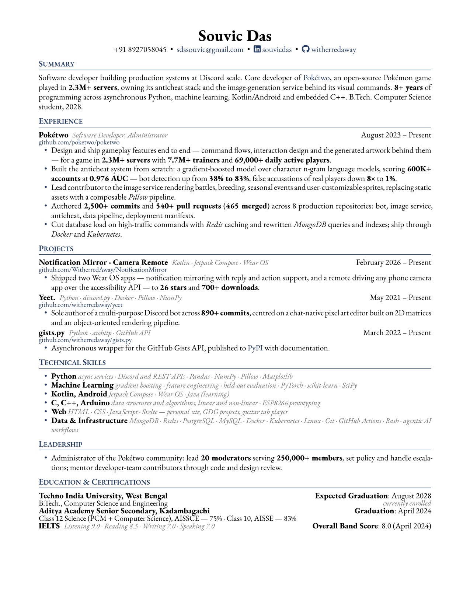

# resume

My curriculum vitae, written in [Typst](https://typst.app/).

- `main.typ` — the content
- `template.typ` — the layout
- `main.pdf` — the compiled output
- `stats.json` — commit, pull request, star and download counts pulled from the GitHub API
- `stats.py` — regenerates `stats.json`

## Build

```sh
typst compile --font-path fonts main.typ
```

Watch and rebuild on every save:

```sh
typst watch --font-path fonts main.typ
```

Regenerate the previews below:

```sh
typst compile --font-path fonts --format png --ppi 150 main.typ "preview-{n}.png"
```

## Stats

The contribution counts in the resume come from `stats.json` rather than being typed in:

```sh
GITHUB_TOKEN=... python3 stats.py
```

A weekly [workflow](.github/workflows/refresh.yml) reruns it, recompiles and commits the result.
Reading the private Pokétwo repositories needs a `STATS_TOKEN` secret with `repo` scope; without it
those counts keep their last known values.


