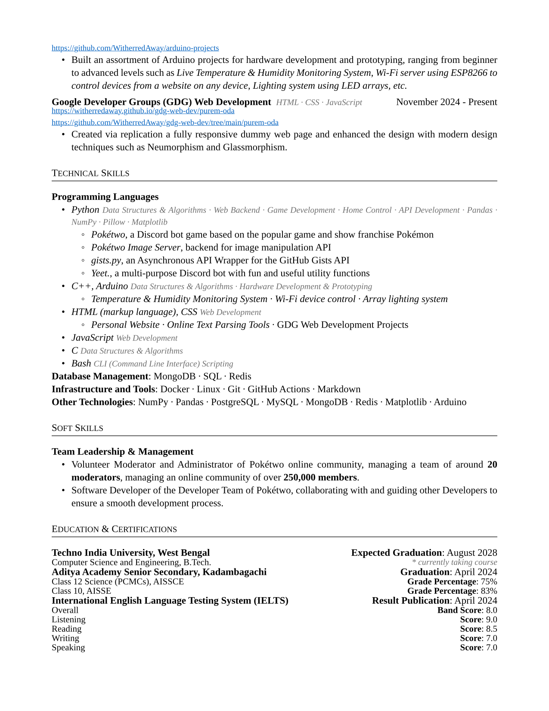

# resume

My curriculum vitae, written in [Typst](https://typst.app/).

- `main.typ` — the content
- `template.typ` — the layout
- `main.pdf` — the compiled output

## Build

```sh
typst compile --font-path fonts main.typ
```

Watch and rebuild on every save:

```sh
typst watch --font-path fonts main.typ
```

Regenerate the previews below:

```sh
typst compile --font-path fonts --format png --ppi 150 main.typ "preview-{n}.png"
```



